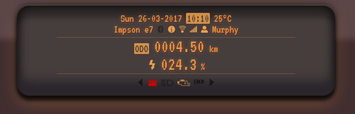

# Dashboard Driver

#### JavaScript study project

In this electronic car simulation game you are a test driver of a newly
developed model that is hooked up to the internet and you need to manage your
vehicle according to the details on the dashboard and the incoming messages on
the message wall.

Keep contact with the garage because you may receive some important tips from
them. Be aware that you need to differentiate between messages, as this test
car can be spammy and you could possibly lose money.

The goal is to keep the car running for as long as possible, while the engine
constantly loses power, which you have to recharge.

The car runs on autopilot, so there is no need for steering, although you can
play with some of its features.

`left` and `right` buttons for changing tracks

`Q` and `E` for using the indicators

`L` for switching the lights

`A` and `D` for opening the doors

## Screenshots

